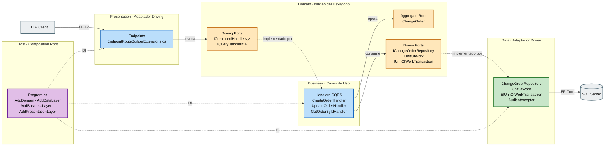

# Auditoría de Arquitectura — ChangeOrder.Api

**Fecha**: 2026-05-18
**Rama base**: `main` (clean)
**Último commit en `main`**: `0202541 Merge pull request #11 from applicapr/docs/adr-bootstrap`
**Release vigente**: v1.1.0 (2026-05-14)
**Alcance**: Verificación de Puertos y Adaptadores (Hexagonal), principios SOLID y catálogo de patrones de diseño implementados.

---

## 1. Puertos y Adaptadores (Hexagonal Architecture)

**Veredicto**: Cumple al 100%. No se detectan fugas de infraestructura hacia el núcleo.

### 1.1. Mapa puerto → adaptador

| Concepto | Significado | Ubicación en el repo |
|---|---|---|
| Núcleo (hexágono) | Lógica pura, sin infraestructura | `ChangeOrder.Domain` + `ChangeOrder.Business` |
| Puerto driven (salida) | Interface definida por el núcleo para hablar con el mundo externo | `Domain/Abstractions/` |
| Puerto driving (entrada) | Contratos de casos de uso invocados desde afuera | `Business/Commands/*` y `Business/Queries/*` (handlers CQRS) |
| Adaptador driven | Implementación concreta del puerto de salida | `ChangeOrder.Data` (EF Core, SQL Server) |
| Adaptador driving | Punto de entrada externo que traduce protocolo → caso de uso | `ChangeOrder.Presentation` (HTTP endpoints) |
| Composition Root | Único lugar de wiring puerto → adaptador | `ChangeOrder.Host/Program.cs` |

### 1.2. Diagrama de flujo puerto → adaptador



**Leyenda de colores**:

| Color | Significado |
|---|---|
| Amarillo (núcleo) | `Domain` — núcleo del hexágono: driving ports, agregado y driven ports |
| Azul (driving) | `Presentation` y `Business` — adaptador de entrada y casos de uso que ejecutan los puertos driving |
| Verde (driven) | `Data` — adaptador de salida que implementa los puertos driven hacia infraestructura |
| Gris (externo) | `HTTP Client` y `SQL Server` — actores fuera del hexágono |
| Morado (wiring) | `Host` — Composition Root, único lugar de binding puerto → adaptador |

**Convenciones de flechas**:

- Flecha sólida (`-->`): invocación o dependencia en tiempo de ejecución.
- Flecha punteada (`-.->`): relación de implementación de un puerto o inyección por DI.

**Lectura del flujo (camino feliz de un `POST /api/v1/change-orders`)**:

1. El `HTTP Client` envía la request al adaptador driving (`Endpoints`).
2. El endpoint resuelve por DI el `ICommandHandler<CreateOrderCommand, ...>` (driving port) e invoca `HandleAsync`.
3. El handler concreto (`CreateOrderHandler`) opera sobre el agregado `ChangeOrder` y consume los driven ports (`IChangeOrderRepository`, `IUnitOfWork`).
4. Esos driven ports están implementados por clases concretas de `Data`, que persisten en `SQL Server` vía EF Core.
5. El `Host` es el único lugar que sabe quién implementa cada puerto: el resto del grafo solo conoce abstracciones.

### 1.3. Puertos definidos en Domain

Ubicación: `src/ChangeOrder.Domain/Abstractions/`.

| Puerto | Tipo | Propósito |
|---|---|---|
| `IChangeOrderRepository` | Driven | Persistencia del agregado (queries, writes, secuencia diaria) |
| `IUnitOfWork` | Driven | Boundary transaccional + mapeo de errores SQL |
| `IUnitOfWorkTransaction` | Driven | Scope transaccional explícito con Commit/Rollback |
| `IAuditable` | Marcador | `CreatedAt`, `UpdatedAt` (pobladas por `AuditInterceptor`) |
| `ISoftDeletable` | Marcador | `IsDeleted`, `DeletedAt` (pobladas por `AuditInterceptor`) |

El Domain no conoce EF Core, ASP.NET, ni MediatR. Verificado por `grep`: cero `using Microsoft.EntityFrameworkCore`, cero `using Microsoft.AspNetCore.*`.

### 1.4. Adaptadores driven (Data)

- `ChangeOrderRepository.cs:19` — implementa `IChangeOrderRepository`. Incluye el raw SQL con `UPDLOCK,HOLDLOCK` para `GetNextSequenceForDateAsync`.
- `UnitOfWork.cs:14` — implementa `IUnitOfWork`. Mapea excepciones SQL (deadlock 1205, UNIQUE constraint, concurrencia) a errores de dominio (`Result.Failure`).
- `EfUnitOfWorkTransaction.cs:13` — implementa `IUnitOfWorkTransaction` sobre `IDbContextTransaction` de EF Core.

`DbContext` y `DbSet` están confinados a Data; no se filtran a otras capas.

### 1.5. Adaptadores driving (Presentation)

`Presentation/Extensions/EndpointRouteBuilderExtensions.cs` registra los endpoints HTTP. Cada endpoint:

1. Recibe el handler por DI.
2. Construye el `Command`/`Query` desde la request.
3. Llama `handler.HandleAsync(...)`.
4. Traduce el `Result<T, Error>` a HTTP (`ProblemDetails` para fallos).

| Endpoint | Línea | Handler |
|---|---|---|
| `POST /api/v1/change-orders` | 194 | `ICommandHandler<CreateOrderCommand, ...>` |
| `GET /api/v1/change-orders` | 322 | `IQueryHandler<GetAllOrdersQuery, ...>` |
| `GET /{id}` | 346 | `IQueryHandler<GetOrderByIdQuery, ...>` |
| `PUT /{id}` | 364 | `ICommandHandler<UpdateOrderCommand, ...>` |
| `DELETE /{id}` | 393 | `ICommandHandler<DeleteOrderCommand, ...>` |
| `PUT /{id}/approvals/{level}` | 265 | `ICommandHandler<RecordApprovalCommand, ...>` |
| `PATCH /{id}/dates` | 295 | `ICommandHandler<RecordMilestoneDatesCommand, ...>` |

Presentation no toca EF Core ni el `DbContext`; solo consume contratos de Business.

### 1.6. Composition Root

`src/ChangeOrder.Host/Program.cs:59-63`:

```csharp
builder.Services
    .AddDomain()
    .AddDataLayer(builder.Configuration)
    .AddBusinessLayer()
    .AddPresentationLayer();
```

Cada capa expone su propio `Extensions/ServiceCollectionExtensions.cs`. El binding `IChangeOrderRepository → ChangeOrderRepository` e `IUnitOfWork → UnitOfWork` vive en `Data/Extensions/ServiceCollectionExtensions.cs:35-36`. Los handlers de CQRS se registran por reflexión en `Business/Extensions/ServiceCollectionExtensions.cs:24-51`.

### 1.7. Inversión de dependencias — pruebas duras

| Regla | Estado |
|---|---|
| Domain sin referencias externas | Conforme |
| Business → solo Domain | Conforme (`Business.csproj`) |
| Data → solo Domain (no Business) | Conforme |
| Presentation → solo Business (no Data) | Conforme |
| Host wirea todo | Conforme |

---

## 2. Principios SOLID

| Principio | Estado | Evidencia |
|---|---|---|
| **SRP** Single Responsibility | Conforme | Handlers orquestan; validators validan (`CreateOrderValidator.cs:20`); repositorios persisten; `AuditInterceptor` audita. Endpoints (`EndpointRouteBuilderExtensions.cs:194-410`) son wiring HTTP puro, sin lógica de negocio. No hay God classes. |
| **OCP** Open/Closed | Conforme | Handlers registrados por reflexión (`Business/Extensions/ServiceCollectionExtensions.cs:24-51`): agregar un nuevo command/query no toca código existente. `DomainErrors.cs:11-73` usa factory methods (no enums). `IdempotencyOutcome` es discriminated union con `switch` exhaustivo. |
| **LSP** Liskov Substitution | Conforme | Todas las implementaciones cumplen contrato sin sorpresas. `EfUnitOfWorkTransaction` respeta `IAsyncDisposable`. No hay herencia con estado compartido; composición pura sobre interfaces. |
| **ISP** Interface Segregation | Conforme | `IChangeOrderRepository` es cohesivo (CRUD del agregado). `IUnitOfWork` segrega `SaveChangesAsync` / `SaveChangesWithDuplicateDetectionAsync` / `SaveChangesWithConcurrencyDetectionAsync` en métodos especializados. Marker interfaces (`IAuditable`, `ISoftDeletable`) con dos propiedades cada una. |
| **DIP** Dependency Inversion | Conforme | Handlers reciben interfaces por constructor (`CreateOrderHandler.cs:44-65`). Endpoints inyectan `ICommandHandler<,>`/`IQueryHandler<,>` tipados directamente. Cero `new SomeService()` donde corresponde DI. |

**Resultado global**: SOLID al 100% en el estado actual de la base.

---

## 3. Catálogo de patrones de diseño implementados

### 3.1. Patrones tácticos de DDD

| Patrón | Ubicación canónica | Rol |
|---|---|---|
| Aggregate Root | `Domain/ChangeOrder.cs:21-268` | Root con transiciones controladas: `SubmitForApproval:149`, `RecordApproval:166`, `UpdateContent:125` |
| Value Object | `OrderNumber.cs:12-54`, `RequesterInfo`, `ChangeOrderContent`, `ApprovalChain` | Records inmutables con validación en factory |
| Factory Method | `OrderNumber.Create:29-43`, `DomainErrors.Order.NotFound()` | Creación validada vía `Result<T, Error>` |

### 3.2. Patrones de aplicación

| Patrón | Ubicación canónica | Rol |
|---|---|---|
| Result Pattern | `Domain/Common/Result.cs:26-52` | `Result<TValue, TError>` para errores como datos, no excepciones |
| CQRS | `Business/Abstractions/ICommandHandler.cs`, `IQueryHandler.cs` | Separación lectura/escritura con handlers especializados |
| Mediator (propio, sin MediatR) | `Business/Extensions/ServiceCollectionExtensions.cs:24-51` | Handlers descubiertos por reflexión; endpoints invocan por tipo genérico |
| Repository | `IChangeOrderRepository` + `ChangeOrderRepository.cs:19` | Abstracción de persistencia del agregado |
| Unit of Work | `IUnitOfWork` + `UnitOfWork.cs:14-111` | Boundary transaccional + mapeo de errores SQL |
| Specification-like (validators) | `CreateOrderValidator.cs:20-120`, `UpdateOrderValidator` | Reglas de validación encapsuladas, retornan `Result` |
| Discriminated Union | `IdempotencyOutcome.cs:9-23` | `Existing | Conflict | Fresh` con `switch` exhaustivo |
| Idempotency Pattern | `IdempotencyService.cs:16-107` | Hash SHA-256 de payload canonicalizado + lookup en tabla de idempotencia |

### 3.3. Patrones de infraestructura

| Patrón | Ubicación canónica | Rol |
|---|---|---|
| Adapter (Ports & Adapters) | `Data/Repositories/`, `Presentation/Extensions/` | Cubierto en sección 1 |
| Interceptor | `Data/Interceptors/AuditInterceptor.cs:14-98` | `SaveChangesInterceptor` pobla `CreatedAt`/`UpdatedAt`/`IsDeleted` |
| Soft Delete | `ISoftDeletable` + global query filter en `ApplicationDbContext` | Borrado lógico transparente |
| Decorator-like | `UnitOfWork.SaveChangesWithDuplicateDetectionAsync:46-68` | Envuelve `SaveChanges` con detección de UNIQUE/concurrency |
| Composition Root | `Host/Program.cs:59-63` | Único lugar de wiring puerto → adaptador |
| Retryable error como dato | `DomainErrors.Order.DeadlockVictim()` (código `order.deadlock_victim`) | Approach C1 (ADR-0002, commit `e56d9af`): deadlock SQL 1205 propagado como `Result.Failure` retryable en lugar de excepción |

### 3.4. Patrones esperables que no están

- **Domain Events** — no hay publicación de eventos al cambiar el estado del agregado. Decisión válida mientras no exista integración pendiente con otros bounded contexts.
- **Strategy** — las transiciones de estado están dentro del agregado; no hay algoritmos intercambiables en runtime.
- **Pipeline behaviors** (estilo MediatR `IPipelineBehavior`) — no hay decorators globales para logging/retry/validation cross-cutting; cada handler maneja lo suyo.
- **Null Object** — se usa `null` con guards (`ArgumentNullException.ThrowIfNull`), no objetos sentinela.

---

## 4. Síntesis

- **Hexagonal / Ports & Adapters**: cumplimiento total. Núcleo aislado, adaptadores en el borde, composición centralizada en Host.
- **SOLID**: cinco principios conformes en el estado actual de la base.
- **Patrones**: aproximadamente 14 patrones mayores identificados, alineados con DDD táctico + CQRS + Clean/Hexagonal.
- **Deuda de patrón notable**: ausencia de Domain Events. Es una decisión válida mientras no haya integración cross-context pendiente.
- **Antipatrones detectados**: ninguno.

## 5. Referencias

- `Docs/ChangeOrder.Api.Rules.md` — fuente de verdad de convenciones del proyecto.
- `Docs/adr/0001-onion-architecture-cqrs.md` — decisión arquitectónica base.
- `Docs/adr/0002-result-pattern-deadlock-retry.md` — origen del patrón "retryable error como dato".
- `specs/001-change-order-management/plan.md` — plan técnico de la feature inicial.
- `CLAUDE.md` (local) — instrucciones operativas para asistentes y guía rápida del repo.
