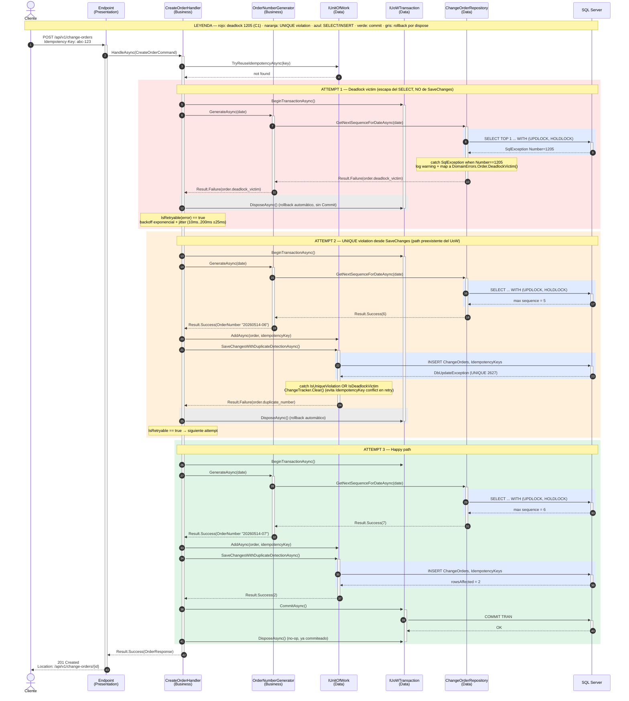

# `POST /api/v1/change-orders` — Retry C1 (deadlock 1205 + UNIQUE violation)

Diagrama de secuencia end-to-end del flujo de creación de change orders, incluyendo
los dos caminos retryables que cubre el handler (`order.deadlock_victim` desde el SELECT
y `order.duplicate_number` desde SaveChanges) y el path feliz que termina en commit.

Implementación: commits `6ec2016` (tx scope por attempt) y `e56d9af` (deadlock retryable).
Approach: C1 (Result retryable propagado). Spec autoritativa: `specs/001-change-order-management/research.md` — R-1.

## Diagrama

## Leyenda de colores

| Color | RGB | Significado |
|---|---|---|
| Rosa | `rgb(255,230,230)` | Attempt con deadlock 1205. La `SqlException` escapa del SELECT, **antes** de SaveChanges. Mapeada a `order.deadlock_victim` en `ChangeOrderRepository` (C1). |
| Durazno | `rgb(255,240,220)` | Attempt con UNIQUE violation. La `DbUpdateException` aparece **desde** SaveChanges. Mapeada a `order.duplicate_number` en `UnitOfWork`. |
| Azul claro | `rgb(225,235,255)` | Llamadas a SQL Server (SELECT y INSERT). |
| Verde | `rgb(225,245,230)` | Attempt exitoso terminando en `CommitAsync`. |
| Gris | `rgb(235,235,235)` | Rollback automático por `DisposeAsync` del `IUnitOfWorkTransaction` cuando no se llamó `CommitAsync`. |

## Puntos clave que el diagrama hace explícitos

1. **Tx scope por attempt**: cada `BeginTransactionAsync` vive dentro del retry-loop, y el `DisposeAsync` ejecuta rollback automático si no hubo `Commit`. Cumple la spec R-1.
2. **Dos lugares distintos donde aparece la 1205**: desde el SELECT (atrapada en el repo, C1) y desde SaveChanges (atrapada en el UoW, preexistente). Ambas terminan en retry, pero por caminos separados con error codes distintos para diagnóstico.
3. **`ChangeTracker.Clear()` después de UNIQUE violation o deadlock en UoW**: evita que `IdempotencyKey` quede tracked como `Added` y choque en el attempt siguiente con `InvalidOperationException ThrowIdentityConflict`.
4. **`IsRetryable(error)` centralizado en `CreateOrderHandler`**: filtra `order.deadlock_victim` y `order.duplicate_number` con `StringComparison.Ordinal`. Backoff exponencial + jitter y `MaxRetryAttempts = 8` viven en una sola capa.
5. **Idempotencia**: el path de `TryReuseIdempotencyAsync` antes del loop garantiza que un segundo `POST` con el mismo `Idempotency-Key` devuelve la misma respuesta sin re-entrar al retry.

## Archivos relevantes

- `src/ChangeOrder.Domain/Errors/DomainErrors.cs` — `Order.DeadlockVictim()`, `Order.DuplicateNumber()`.
- `src/ChangeOrder.Domain/Abstractions/IChangeOrderRepository.cs` — firma `Task<Result<int, Error>> GetNextSequenceForDateAsync(...)`.
- `src/ChangeOrder.Data/Repositories/ChangeOrderRepository.cs` — catch `SqlException Number==1205`.
- `src/ChangeOrder.Data/Repositories/UnitOfWork.cs` — `SaveChangesWithDuplicateDetectionAsync` con catch de UNIQUE + deadlock + `ChangeTracker.Clear()`.
- `src/ChangeOrder.Data/Repositories/EfUnitOfWorkTransaction.cs` — rollback en `DisposeAsync` si no se commiteó.
- `src/ChangeOrder.Business/Services/OrderNumberGenerator.cs` — propaga `Result` verbatim.
- `src/ChangeOrder.Business/Commands/CreateOrder/CreateOrderHandler.cs` — `IsRetryable`, `MaxRetryAttempts = 8`, backoff exponencial + jitter.
