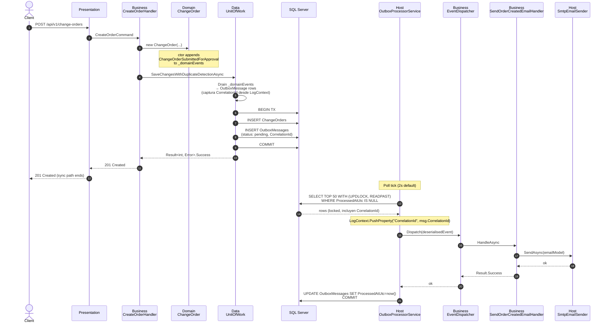
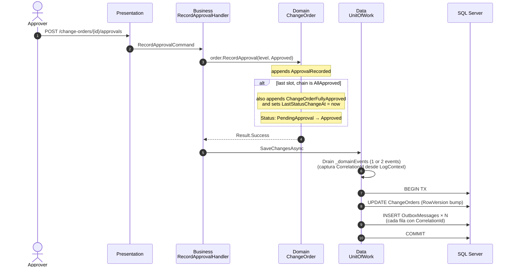
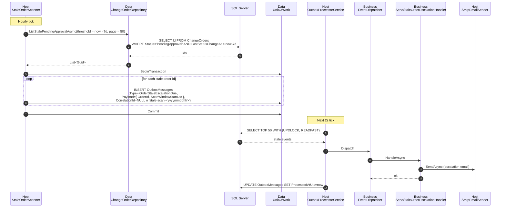
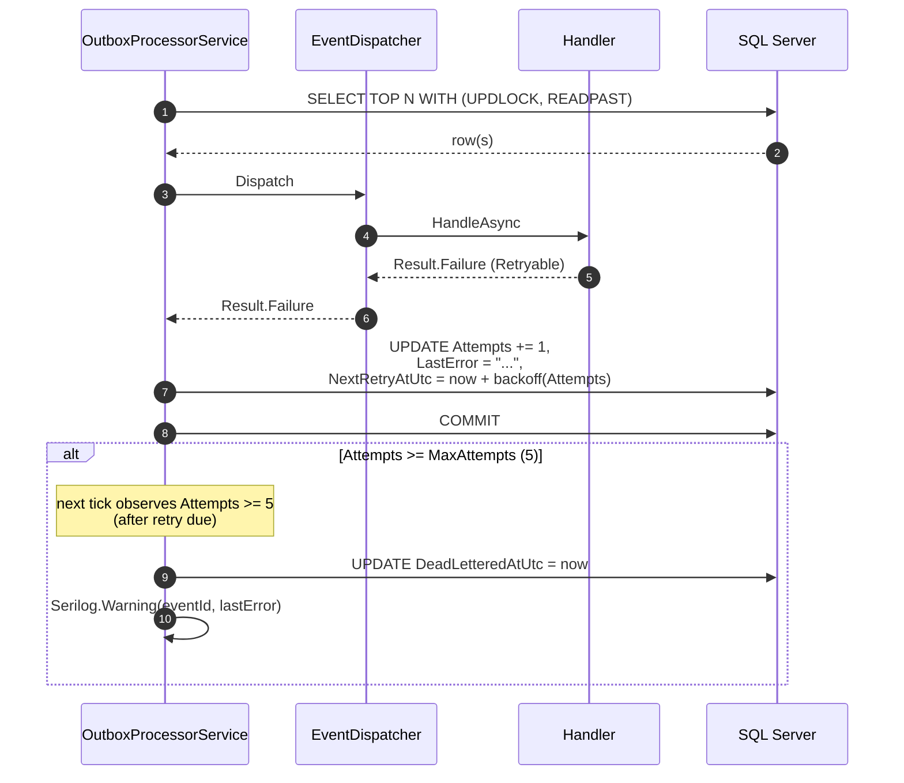

# Design: EDA Outbox Foundation

**Change**: `eda-outbox-foundation`
**Folder**: `specs/002-eda-outbox-foundation/`
**Date**: 2026-05-19
**Status**: Draft (design phase)
**Authoritative ADR**: [`Docs/adr/0009-eda-domain-events-outbox.md`](../../Docs/adr/0009-eda-domain-events-outbox.md) (`Proposed`)
**Predecessor artefact**: [`proposal.md`](./proposal.md)

> This design document only details the **how** of the six pieces that ADR-0009
> already locked. It does **not** revisit alternatives A / C / D — those were
> closed in the ADR. Any contradiction between this design and the ADR is a bug
> in this document.

---

## 1. Technical Approach

The change introduces in-process Event-Driven Architecture on top of the
existing Onion + CQRS skeleton **without** adding edges to the dependency
graph. The strategy is:

1. **Domain stays infrastructure-free.** A bare `IDomainEvent` marker, a
   `_domainEvents` field on the `ChangeOrder` aggregate root, and one immutable
   `record` per emitted event live in `ChangeOrder.Domain`. No reference to EF
   Core, MediatR, `System.Text.Json` serialisation attributes or any package
   beyond the BCL.
2. **Outbox is a Data concern.** A new `OutboxMessage` EF entity, its
   `EntityTypeConfiguration`, a migration and the drain hook inside
   `UnitOfWork.SaveChangesAsync` live in `ChangeOrder.Data`. The drain runs
   **inside the same `DbContext.SaveChangesAsync` call** that persists the
   aggregate, so the implicit transaction (or the explicit one opened via
   `IUnitOfWorkTransaction`, ADR-0003) covers both writes atomically.
3. **Handlers live in Business.** Side-effect orchestration (send email,
   project to future SignalR, log escalation) is implemented as
   `IDomainEventHandler<TEvent>` classes in `ChangeOrder.Business`. They depend
   only on `IEmailSender` (Business abstraction) and other already-allowed
   contracts. **No reference to EF Core.**
4. **Workers live in Host.** `OutboxProcessorService` and `StaleOrderScanner`
   are `BackgroundService`s registered through Host's composition root. They
   use `IServiceScopeFactory` (same pattern as `IdempotencyCleanupService`) to
   open a scope per tick.
5. **SMTP adapter lives in Host** as the concrete `IEmailSender`. The
   abstraction is the seam; the implementation is at the edge.

This preserves the layer rules of ADR-0001 verbatim and reuses ADR-0002
(Result retryable) and ADR-0003 (`IUnitOfWorkTransaction`) without
modification. The dispatcher loop interprets the failing `Error.Code` to
distinguish retryable from permanent failures, mirroring the existing
`order.deadlock_victim` convention.

---

## 2. Architecture Decisions

The ADR settled the six headline pieces. The decisions below resolve concrete
ambiguities or trade-offs that the ADR explicitly deferred to the design phase.

### Decision D1: `LastStatusChangeAt` is a NEW dedicated column, not a reuse of `UpdatedAt`

- **Choice**: Add a new `LastStatusChangeAt` `datetime2` column to
  `dbo.ChangeOrders`, populated by the aggregate **only on status transitions**
  (`SubmitForApproval`, `RecordApproval`, `RecordDeliveryDate`,
  `RecordProductionDeploy`, `Cancel`).
- **Alternatives considered**:
  - Reuse `IAuditable.UpdatedAt` — rejected because `UpdatedAt` is rewritten
    on every modification (e.g. `UpdateContent` or future field-only edits),
    so a stale `PendingApproval` order would never qualify for escalation if a
    requester touched a typo in `WorkDescription`.
  - Track `(Status, ChangedAt)` history in a side table — rejected as over-
    scoped. The scanner only needs the **latest** transition timestamp; full
    history can be derived from the Outbox itself if needed in the future.
- **Rationale**: ADR-0009 says "`LastStatusChangeAt < UtcNow - 7d`" but the
  proposal uses "`LastUpdatedAt`". The aggregate today only owns `UpdatedAt`
  (set by `AuditInterceptor`). Conflating them silently would break the SLA
  on edits. A dedicated column is the smallest correct fix and stays purely
  in Domain (`private set;` from inside the transition methods, never via
  interceptor).

### Decision D2: Outbox payload is `System.Text.Json` with explicit per-event DTOs in Data, NOT direct serialisation of the Domain `record`

- **Choice**: For each `IDomainEvent`, define a sibling `OutboxPayload`
  contract in `ChangeOrder.Data/Outbox/Payloads/` that the drain serialises.
  The Domain `record` stays a pure CLR type; the JSON shape is owned by Data.
- **Alternatives considered**:
  - Serialise the Domain `record` directly with `JsonSerializer.Serialize` —
    rejected because it would freeze internal Domain shape as wire-contract
    and discourage refactors (rename a Domain property and the payload
    silently changes).
  - Push the payload contract into Domain — rejected because it would force
    Domain to take a `System.Text.Json` package reference (it currently has
    none) just for serialisation metadata.
- **Rationale**: Same separation as the existing `OrderResponse` DTO vs the
  Domain entity. The drain owns the translation; Domain stays infra-free.
  When (and only when) a real cross-process consumer appears, the Data-side
  payload becomes the integration contract — a clean seam for the future
  ADR that will deprecate this one.

### Decision D3: Dispatcher concurrency uses `UPDLOCK, READPAST` row-lease, NOT a global mutex

- **Choice**: The `OutboxProcessorService` poll query is
  `SELECT TOP (@batch) ... FROM dbo.OutboxMessages WITH (UPDLOCK, READPAST)
  WHERE ProcessedAtUtc IS NULL AND DeadLetteredAtUtc IS NULL AND (NextRetryAtUtc IS NULL OR NextRetryAtUtc <= SYSUTCDATETIME())
  ORDER BY OccurredAtUtc`.
  The selected rows are kept under row-lock for the lifetime of the
  enclosing transaction; `READPAST` lets any second instance skip locked
  rows instead of blocking.
- **Alternatives considered**:
  - Single-instance assumption + simple `WHERE ProcessedAtUtc IS NULL` —
    rejected because a future scale-out (two pods of the API) would
    silently double-process every message.
  - Distributed lock via `sp_getapplock` — rejected as heavier than needed
    and incompatible with READPAST-style parallel draining.
- **Rationale**: SQL Server's `UPDLOCK, READPAST` is the idiomatic Outbox
  pattern on this engine and is already familiar to the codebase
  (`GetNextSequenceForDateAsync` uses `UPDLOCK + HOLDLOCK` for the
  sequence read). Adopting the same hint family keeps operational
  knowledge consistent and unblocks future horizontal scale-out without
  reopening this design.

### Decision D4: Retry schedule is exponential with explicit caps and a hard dead-letter limit

- **Choice**:
  - Default base backoff: `30 seconds`.
  - Growth: doubling per attempt (`30s, 60s, 120s, 240s, 480s, 960s`).
  - Cap: `30 minutes` (`1800s`).
  - Max attempts before dead-letter: `5`.
  - Jitter: `±15%` randomised per attempt (avoids thundering-herd on
    transient SMTP outages).
  - On dead-letter: `DeadLetteredAtUtc = SYSUTCDATETIME()` is written, the
    row stays in the table (no archival in this change) and Serilog
    emits a `Warning` with the event id + last `LastError`.
- **Alternatives considered**:
  - Fixed 60s retry — rejected; floods the SMTP server during outages.
  - Infinite retries — rejected; a permanently broken handler would spin
    forever and starve healthy handlers.
- **Rationale**: ADR-0009 picks "exponential backoff" without numbers; the
  proposal says "5 attempts, cap unspecified". Picking 30s base / 30min cap
  / 5 attempts gives a worst-case message life of ~50 minutes before
  dead-letter, which is well within the 7-day stale-scanner cadence and
  acceptable for email notifications.

### Decision D5: Handlers MUST be idempotent from day one; no de-dup table in Data

- **Choice**: Every `IDomainEventHandler<T>` documents and enforces its own
  idempotency. The Outbox does **not** ship a generic "handled events" table.
  Concrete strategies:
  - `SendOrderCreatedEmailHandler`: send-and-log; SMTP server's own dedup
    plus a deterministic `Message-Id` header `({OrderId}.created@changeorder)`
    so the recipient mail server collapses duplicates.
  - `SendApprovalNotificationHandler`: same pattern, `Message-Id` derived
    from `({OrderId}.{Level}.{Verdict}@changeorder)`.
  - `SendStaleOrderEscalationHandler`: scanner emits one event per
    `(OrderId, ScanWindowStart)` pair; the handler dedups by that key. The
    `OrderStaleEscalationDue` payload carries `ScanWindowStartUtc` for
    that reason.
- **Alternatives considered**:
  - Generic `ProcessedEvents (EventId, HandlerName)` table populated by
    the dispatcher — rejected as premature; adds a write per dispatch and
    a foreign integrity surface that nothing today demands.
- **Rationale**: At-least-once delivery is the price of the Outbox pattern;
  idempotency must live in the handlers. Doing it explicitly per handler
  exposes the assumption in code review instead of hiding it behind a
  framework.

### Decision D6: `OutboxProcessorService` runs as **single-instance** today, with `READPAST` ready for tomorrow

- **Choice**: Operationally we run one API pod. The lock hints from D3 mean
  a second pod, if/when it appears, is safe by construction — no code
  change required. The hosting decision is captured here but not encoded
  in the binary (no `IsLeader` flag, no leader-election logic).
- **Rationale**: Captures the operational truth and the safety property
  in one place. Avoids the temptation to ship leader-election complexity
  that no current deployment needs.

### Decision D7: `StaleOrderScanner` filters at the database, paginates the result, and writes events in batches of 50

- **Choice**: The hourly scan is
  `SELECT Id FROM dbo.ChangeOrders WHERE Status = 'PendingApproval' AND LastStatusChangeAt < DATEADD(day, -7, SYSUTCDATETIME()) AND IsDeleted = 0`,
  materialised into pages of `50` rows. For each page, the scanner opens
  one `IUnitOfWorkTransaction`, appends 50 `OrderStaleEscalationDue` events
  to the Outbox, and commits. If a page commit fails, the next tick re-
  reads the same orders (idempotency by `ScanWindowStartUtc` truncation
  — see D5).
- **Rationale**: Hourly + page-50 keeps a worst-case batch at ~600 rows /
  10s (assuming pessimistic 60k stale orders, which we will never hit).
  Batching avoids one transaction per row and bounds memory.

### Decision D8: No new package references on Domain or Business

- **Choice**: `IDomainEvent`, event records and `_domainEvents` go in
  `ChangeOrder.Domain` with **zero** new `PackageReference`s.
  `OutboxPayload` DTOs in `ChangeOrder.Data` use the already-transitively
  available `System.Text.Json`. Business uses the existing `Microsoft.Extensions.*`
  surface. SMTP adapter in Host can bring `MailKit` if needed (Host already
  depends on infra packages).
- **Rationale**: Direct enforcement of ADR-0001 layer rules. If a reviewer
  sees a new `<PackageReference>` in `ChangeOrder.Domain.csproj` after this
  change, the PR is wrong.

### Decisión D9: `CorrelationId` se persiste como columna de `OutboxMessages`, no en el `Payload`

- **Choice**: Se agrega la columna nullable `CorrelationId NVARCHAR(64) NULL`
  a `dbo.OutboxMessages`. El valor se obtiene desde el contexto Serilog
  (`Serilog.Context.LogContext`, propiedad `CorrelationId` ya emitida por el
  middleware HTTP existente) al momento del drain dentro de
  `UnitOfWork.SaveChangesAsync` y se asigna directamente a la columna. El
  payload JSON del evento **no** lo lleva: la trazabilidad operativa vive en
  la tabla, el wire-contract del evento queda intacto y libre de metadatos de
  infraestructura.
- **Propagación al handler**: `OutboxProcessorService`, antes de invocar al
  dispatcher para cada fila, hace `using
  (LogContext.PushProperty("CorrelationId", msg.CorrelationId)) { await
  dispatcher.DispatchAsync(evt, ct).ConfigureAwait(false); }`. Eso garantiza
  que los logs del handler (envío de correo, errores, retries) salgan con el
  mismo `CorrelationId` que la petición HTTP original, cerrando la trazabilidad
  request → outbox row → dispatch → side-effect.
- **Eventos sin origen HTTP**: cuando `StaleOrderScanner` inserta filas, no
  hay request en curso. Dos opciones son válidas (resolución diferida a tasks):
  (a) dejar `CorrelationId = NULL` y aceptar la pérdida de correlación para
  eventos sintéticos, o (b) generar un identificador sintético determinístico
  por ventana (`stale-scan-<yyyymmddhh>`). La columna es nullable para soportar
  ambas.
- **Sin índice**: la cardinalidad es alta y los queries operativos relevantes
  filtran primero por `DeadLetteredAtUtc` / `EventType` / `ProcessedAtUtc`. Un
  índice por `CorrelationId` no agregaría valor al hot path del dispatcher y
  ensanchaba la tabla innecesariamente.
- **Alternatives considered**:
  - Embeber `correlationId` dentro del JSON del payload — rechazado porque
    contamina el wire-contract del evento con un campo operativo y obliga a
    los consumidores futuros a conocerlo.
  - Tabla aparte de correlación (`OutboxCorrelations`) — rechazado por
    sobre-ingeniería; una columna nullable resuelve el caso al 100%.
- **Rationale**: Cierra la observabilidad request → outbox → handler con costo
  mínimo (una columna + dos líneas de código en drain y dispatcher).

---

## 3. Sequence Diagrams

### 3.1 Flow A: `CreateOrder` → `ChangeOrderSubmittedForApproval` → Outbox → Email dispatch



### 3.2 Flow B: State transition (`RecordApproval` → `Approved`) emits two events

When the final approval pushes the chain to `AllApproved`, the aggregate emits
**both** `ApprovalRecorded` (always) and `ChangeOrderFullyApproved` (only when
the chain closes). The drain serialises both into the Outbox in the same
transaction.



### 3.3 Flow C: Stale scan → `OrderStaleEscalationDue` → Outbox → Escalation handler



### 3.4 Flow D: Handler failure → retry → dead-letter



---

## 4. Data Model — `OutboxMessages` Table (SQL Server DDL)

```sql
CREATE TABLE [dbo].[OutboxMessages] (
    [Id]                  UNIQUEIDENTIFIER  NOT NULL,
    [OccurredAtUtc]       DATETIME2(7)      NOT NULL,
    [EventType]           NVARCHAR(256)     NOT NULL,
    [Payload]             NVARCHAR(MAX)     NOT NULL,
    [ProcessedAtUtc]      DATETIME2(7)      NULL,
    [Attempts]            INT               NOT NULL CONSTRAINT [DF_OutboxMessages_Attempts] DEFAULT (0),
    [LastError]           NVARCHAR(MAX)     NULL,
    [NextRetryAtUtc]      DATETIME2(7)      NULL,
    [DeadLetteredAtUtc]   DATETIME2(7)      NULL,
    [CorrelationId]       NVARCHAR(64)      NULL,
    [CreatedAt]           DATETIME2(7)      NOT NULL,

    CONSTRAINT [PK_OutboxMessages] PRIMARY KEY CLUSTERED ([Id] ASC)
);

-- Hot path for the dispatcher poll: pending + not dead-lettered + due.
-- Filtered index keeps it tiny even at high throughput because rows leave it
-- once ProcessedAtUtc or DeadLetteredAtUtc is set.
CREATE NONCLUSTERED INDEX [IX_OutboxMessages_Pending]
    ON [dbo].[OutboxMessages] ([OccurredAtUtc] ASC)
    INCLUDE ([EventType], [Attempts], [NextRetryAtUtc])
    WHERE [ProcessedAtUtc] IS NULL AND [DeadLetteredAtUtc] IS NULL;

-- Operational queries: backlog by event type, dead-letter audit.
CREATE NONCLUSTERED INDEX [IX_OutboxMessages_EventType_DeadLettered]
    ON [dbo].[OutboxMessages] ([EventType] ASC, [DeadLetteredAtUtc] ASC);
```

### Column rationale

| Column | Why |
|---|---|
| `Id` | Surrogate PK — also used as the wire `EventId` if/when these become integration events. |
| `OccurredAtUtc` | Authoritative ordering key for the dispatcher (`ORDER BY` in the poll). Set by `UnitOfWork` at drain time, not by `AuditInterceptor`. |
| `EventType` | Fully qualified CLR type name (`ChangeOrder.Domain.Events.ChangeOrderSubmittedForApproval`). The dispatcher uses it to resolve the handler. |
| `Payload` | `nvarchar(max)` JSON. Schema is per-event (see §5). |
| `ProcessedAtUtc` | Success marker. `NULL` = pending. |
| `Attempts` | Retry counter; participates in the filtered index hint. |
| `LastError` | Last `Error.Code` + `Error.Message` for ops triage. |
| `NextRetryAtUtc` | Backoff gate. The poll query filters `NextRetryAtUtc IS NULL OR NextRetryAtUtc <= SYSUTCDATETIME()`. |
| `DeadLetteredAtUtc` | Terminal failure marker. Once set, the row is invisible to the poll filter. |
| `CorrelationId` | Correlación operativa extremo a extremo. Capturado desde `LogContext` de Serilog al momento del drain (`UnitOfWork.SaveChangesAsync`). Sin índice — cardinalidad alta y no se usa como predicate principal en las queries operativas; los reportes que lo necesiten escanean por `DeadLetteredAtUtc` / `EventType` primero. Persistido en la columna, **no** en el JSON del `Payload`. Nullable: cuando el evento se origina fuera del pipeline HTTP (p. ej. `StaleOrderScanner`) la columna queda `NULL` o el scanner inyecta uno sintético (`stale-scan-<yyyymmddhh>`). |
| `CreatedAt` | Audit only — when the row was inserted (equals or near-equals `OccurredAtUtc`). |

### EF Core configuration outline (in `ChangeOrder.Data`)

`OutboxMessageConfiguration : IEntityTypeConfiguration<OutboxMessage>` produces
the table above. Notes:

- `Payload` mapped as `string` with `.HasColumnType("nvarchar(max)")`.
- `CorrelationId` mapped as `string?` con `.HasMaxLength(64).IsRequired(false)`.
- Filtered index expressed via `.HasFilter("[ProcessedAtUtc] IS NULL AND [DeadLetteredAtUtc] IS NULL")`.
- `OutboxMessage` does **not** implement `IAuditable` — its
  `CreatedAt` is set explicitly by the drain code, so the existing
  `AuditInterceptor` does not touch it.
- `OutboxMessage` does **not** implement `ISoftDeletable` — soft-delete
  semantics make no sense for an append-only log.

### Schema change to `dbo.ChangeOrders`

Add one column for D1:

```sql
ALTER TABLE [dbo].[ChangeOrders]
    ADD [LastStatusChangeAt] DATETIME2(7) NULL;

-- Backfill existing rows so the first scanner tick after deploy doesn't
-- escalate every legacy PendingApproval order on the same day:
UPDATE [dbo].[ChangeOrders]
SET    [LastStatusChangeAt] = COALESCE([UpdatedAt], [CreatedAt])
WHERE  [LastStatusChangeAt] IS NULL;

-- Then make it required for new rows.
ALTER TABLE [dbo].[ChangeOrders]
    ALTER COLUMN [LastStatusChangeAt] DATETIME2(7) NOT NULL;
```

A filtered index supports the scanner:

```sql
CREATE NONCLUSTERED INDEX [IX_ChangeOrders_PendingApproval_Stale]
    ON [dbo].[ChangeOrders] ([LastStatusChangeAt] ASC)
    INCLUDE ([Id])
    WHERE [Status] = 'PendingApproval' AND [IsDeleted] = 0;
```

Both DDLs are emitted by the same EF Core migration as the
`OutboxMessages` table (see §7 file changes).

---

## 5. Event Contracts (Domain `record`s + JSON payloads)

### 5.1 Marker interface

```csharp
// src/ChangeOrder.Domain/Abstractions/IDomainEvent.cs
namespace ChangeOrder.Domain.Abstractions;

/// <summary>
/// Marker for in-process domain events emitted by aggregate roots.
/// Implementations MUST be immutable records and carry only data the
/// handler needs — no behaviour, no references to infrastructure.
/// </summary>
public interface IDomainEvent
{
    /// <summary>UTC instant at which the event was raised by the aggregate.</summary>
    public DateTime OccurredAtUtc { get; }
}
```

### 5.2 Concrete events (Domain `records`)

All live in `src/ChangeOrder.Domain/Events/` — one file per type, file-scoped
namespace `ChangeOrder.Domain.Events`. Each is a single-line `record` for
clarity (no behaviour).

| Event | Raised by | Payload fields |
|---|---|---|
| `ChangeOrderSubmittedForApproval` | `ChangeOrder` ctor + `SubmitForApproval` | `OrderId`, `OrderNumber`, `RequesterEmail`, `OccurredAtUtc` |
| `ApprovalRecorded` | `RecordApproval` (always, includes `Verdict = Rejected`) | `OrderId`, `OrderNumber`, `Level`, `Verdict`, `OccurredAtUtc` |
| `ChangeOrderFullyApproved` | `RecordApproval` when chain closes | `OrderId`, `OrderNumber`, `OccurredAtUtc` |
| `MilestoneDatesUpdated` | `RecordDeliveryDate`, `RecordInitialEvaluationDate`, `RecordProductionDeploy` | `OrderId`, `Kind` (enum: `Delivery` / `InitialEvaluation` / `ProductionDeploy`), `DateUtc`, `OccurredAtUtc` |
| `ChangeOrderCancelled` | `Cancel` | `OrderId`, `OrderNumber`, `OccurredAtUtc` |
| `OrderStaleEscalationDue` | `StaleOrderScanner` (NOT aggregate) | `OrderId`, `OrderNumber`, `LastStatusChangeAtUtc`, `ScanWindowStartUtc`, `OccurredAtUtc` |

> **Nota — `ChangeOrderRejected` queda fuera de este cambio.** El evento aparecía
> en el borrador previo del design (alineado con la lista del proposal) pero el
> agregado actual no expone un estado terminal `Rejected`: `RecordApproval(verdict =
> Rejected)` solo agrega la entrada al chain de aprobaciones y deja `Status` en
> `PendingApproval`. Comportamiento confirmado y mantenido: `RecordApproval` con
> `Verdict = Rejected` sigue emitiendo `ApprovalRecorded` con ese veredicto, sin
> mover el estado del agregado. Si en el futuro el negocio plantea un caso real
> para `OrderStatus.Rejected` como estado terminal del agregado, se redactará un
> ADR aparte y se reintroducirá `ChangeOrderRejected` con un cambio dedicado.
> Esta desviación queda registrada únicamente en este design — el ADR-0009 es
> inmutable y conserva su redacción original.
>
> **Nota — `ChangeOrderCancelled` promovido a first-class.** El proposal listaba
> seis eventos; este design lo eleva a evento de transición de pleno derecho para
> que `Cancel()` no quede como una transición silenciosa. El handler concreto se
> difiere — registrar uno más adelante es puramente aditivo y no requiere
> cambios estructurales.

### 5.3 JSON payload schemas (Outbox wire shape)

Owned by `ChangeOrder.Data/Outbox/Payloads/`. Each Domain event has a matching
`OutboxPayload` `record` (see D2). Example for the create flow:

```json
{
  "$schema": "https://changeorder.api/outbox/v1/ChangeOrderSubmittedForApproval.json",
  "eventId": "8c1b4c3a-2e7e-4b58-8e7d-ac8b3f3f7a01",
  "occurredAtUtc": "2026-05-19T13:42:11.4720000Z",
  "orderId": "2f6c3a4d-8a30-49b5-9d1f-72be90e22b9c",
  "orderNumber": "20260519-01",
  "requesterEmail": "jose.lara@applica.pr"
}
```

```json
{
  "$schema": "https://changeorder.api/outbox/v1/ApprovalRecorded.json",
  "eventId": "f4b2...",
  "occurredAtUtc": "2026-05-19T14:00:00.0000000Z",
  "orderId": "2f6c3a4d-8a30-49b5-9d1f-72be90e22b9c",
  "orderNumber": "20260519-01",
  "level": "DepartmentHead",
  "verdict": "Approved"
}
```

```json
{
  "$schema": "https://changeorder.api/outbox/v1/OrderStaleEscalationDue.json",
  "eventId": "aa12...",
  "occurredAtUtc": "2026-05-26T13:00:00.0000000Z",
  "orderId": "2f6c3a4d-8a30-49b5-9d1f-72be90e22b9c",
  "orderNumber": "20260519-01",
  "lastStatusChangeAtUtc": "2026-05-19T13:42:11.4720000Z",
  "scanWindowStartUtc": "2026-05-26T13:00:00.0000000Z"
}
```

```json
{
  "$schema": "https://changeorder.api/outbox/v1/ChangeOrderCancelled.json",
  "eventId": "bb34...",
  "occurredAtUtc": "2026-05-19T16:10:00.0000000Z",
  "orderId": "2f6c3a4d-8a30-49b5-9d1f-72be90e22b9c",
  "orderNumber": "20260519-01"
}
```

Field rules:

- All timestamps are UTC, ISO-8601 with 7-digit fractional seconds (matches
  SQL Server `datetime2(7)`).
- Enums (`Level`, `Verdict`, `Kind`) serialised as `string`, not numeric
  ordinal — guards against future enum-value renumbering.
- The `$schema` URL is **documentary only** today (no schema-registry
  exists). It is included so a future broker migration can wire validation
  without a payload rewrite.
- **`CorrelationId` NO viaja en el JSON del payload** (ver D9). Es metadato
  operativo y vive exclusivamente en la columna `CorrelationId` de la fila de
  `OutboxMessages`. El wire-contract del evento queda libre de campos de
  infraestructura; cualquier consumidor externo futuro que necesite
  correlación la recibirá a través de un header de mensajería, no del
  payload.

---

## 6. Threading & Concurrency Model

### Drain inside `UnitOfWork.SaveChangesAsync`

```csharp
// Conceptual outline — actual implementation in src/ChangeOrder.Data/Repositories/UnitOfWork.cs
public Task<int> SaveChangesAsync(CancellationToken cancellationToken)
{
    DrainDomainEventsToOutbox();          // synchronous; mutates ChangeTracker
    return _dbContext.SaveChangesAsync(cancellationToken);
}
```

- `DrainDomainEventsToOutbox` walks the ChangeTracker, picks every entry
  whose `Entity` is an aggregate root carrying `_domainEvents`, serialises
  each to an `OutboxMessage` row, calls `ClearDomainEvents()`, and adds
  the rows via `_dbContext.OutboxMessages.Add(...)`.
- En el mismo paso, el drain captura el `CorrelationId` desde
  `Serilog.Context.LogContext` (propiedad `CorrelationId` ya empujada por el
  middleware HTTP del proyecto) y lo asigna a cada `OutboxMessage.CorrelationId`
  antes de agregar la fila al `ChangeTracker`. Si la propiedad no existe en el
  contexto (por ejemplo, eventos originados por `StaleOrderScanner`), la
  columna queda `NULL` o el scanner inyecta un identificador sintético antes
  del insert. Ver D9.
- The drain happens **before** the actual `SaveChangesAsync` call but
  inside the same caller-supplied transaction (if any). When no explicit
  transaction is open, EF Core wraps the whole `SaveChangesAsync` in an
  implicit transaction, which still gives atomicity.
- `SaveChangesWithDuplicateDetectionAsync` and
  `SaveChangesWithConcurrencyDetectionAsync` MUST also call the drain.
  Implementation note: extract the drain into a private helper to avoid
  forgetting it in any of the three variants.

### Dispatcher poll loop

- Uses `IServiceScopeFactory` to open a fresh scope per tick (same as
  `IdempotencyCleanupService`). DbContext is **not** a singleton.
- Each poll opens an `IUnitOfWorkTransaction`, runs the lock-and-claim
  SELECT (D3), iterates dispatched events, and commits once all rows
  in the batch are updated.
- Batch size is `50` by default (configurable).
- **Propagación de `CorrelationId`** (D9): antes de invocar al dispatcher
  por cada fila, el processor empuja la columna al `LogContext` de Serilog:

  ```csharp
  foreach (OutboxMessage msg in batch)
  {
      using IDisposable? correlationScope = !string.IsNullOrEmpty(msg.CorrelationId)
          ? LogContext.PushProperty("CorrelationId", msg.CorrelationId)
          : null;

      IDomainEvent evt = serializer.Deserialize(msg.EventType, msg.Payload);
      Result<TVoid, Error> dispatchResult = await dispatcher
          .DispatchAsync(evt, ct)
          .ConfigureAwait(false);
      // ... handle result (mark processed | record failure | dead-letter)
  }
  ```

  Eso garantiza que todo log emitido por el handler (envío SMTP, errores,
  retries) salga con el mismo `CorrelationId` que la petición HTTP que
  originó la fila, cerrando la trazabilidad extremo a extremo.
- A dispatched event whose handler throws (vs returns `Result.Failure`)
  is treated as transient: the exception is caught at the dispatcher
  level, logged with the full stack via Serilog, and the row is updated
  with `Attempts += 1` + `NextRetryAtUtc` + `LastError`.

### Stale scanner

- Single instance assumption (D6). One tick per hour. Page size 50.
- If two pods ever run, the scanner is **not** UPDLOCK-protected; both
  pods could emit duplicate `OrderStaleEscalationDue` for the same
  window. Idempotency is enforced by D5 (`ScanWindowStartUtc` is rounded
  to the hour at scanner level).

### Cancellation tokens

- Both background services use the `stoppingToken` from `BackgroundService.ExecuteAsync`.
- On host shutdown, an in-flight handler runs to completion (or to its
  own cooperative cancellation). The transaction commits or rolls back
  cleanly — no half-state.

---

## 7. Layer Mapping & File Changes

Cross-checked against ADR-0001 layer rules. **No new edges in the dependency
graph**; only intra-layer additions.

### 7.1 `ChangeOrder.Domain` (zero external deps)

| File | Action | Description |
|------|--------|-------------|
| `src/ChangeOrder.Domain/Abstractions/IDomainEvent.cs` | Create | Marker interface (§5.1). |
| `src/ChangeOrder.Domain/Events/ChangeOrderSubmittedForApproval.cs` | Create | `record` (§5.2). |
| `src/ChangeOrder.Domain/Events/ApprovalRecorded.cs` | Create | `record`. |
| `src/ChangeOrder.Domain/Events/ChangeOrderFullyApproved.cs` | Create | `record`. |
| `src/ChangeOrder.Domain/Events/MilestoneDatesUpdated.cs` | Create | `record`. |
| `src/ChangeOrder.Domain/Events/ChangeOrderCancelled.cs` | Create | `record`. |
| `src/ChangeOrder.Domain/Events/OrderStaleEscalationDue.cs` | Create | `record`. |
| `src/ChangeOrder.Domain/Entities/ChangeOrder.cs` | Modify | Add `private readonly List<IDomainEvent> _domainEvents = []`; expose `IReadOnlyCollection<IDomainEvent> DomainEvents`; `ClearDomainEvents()`. Add `LastStatusChangeAt` (D1). Each transition method calls `_domainEvents.Add(...)` after a successful state mutation and updates `LastStatusChangeAt` when the transition changes `Status`. |

### 7.2 `ChangeOrder.Data` (depends only on Domain)

| File | Action | Description |
|------|--------|-------------|
| `src/ChangeOrder.Data/Entities/OutboxMessage.cs` | Create | EF entity matching §4 columns (incluye `CorrelationId` nullable, máx. 64 chars). |
| `src/ChangeOrder.Data/Configurations/OutboxMessageConfiguration.cs` | Create | EF mapping + filtered index + `.HasMaxLength(64).IsRequired(false)` para `CorrelationId`. |
| `src/ChangeOrder.Data/Configurations/ChangeOrderConfiguration.cs` | Modify | Add `.Property(o => o.LastStatusChangeAt).IsRequired()` + the filtered index on `(Status='PendingApproval' AND IsDeleted=0)`. |
| `src/ChangeOrder.Data/Outbox/IOutboxPayload.cs` | Create | Marker for per-event payload contracts. |
| `src/ChangeOrder.Data/Outbox/Payloads/*.cs` | Create | One payload `record` per Domain event (D2). |
| `src/ChangeOrder.Data/Outbox/OutboxEventSerializer.cs` | Create | `Serialize(IDomainEvent) → (string EventType, string PayloadJson)` and `Deserialize(string EventType, string PayloadJson) → IDomainEvent`. Uses `System.Text.Json` + a static `Dictionary<string, Type>` event-type registry. |
| `src/ChangeOrder.Data/Persistence/ApplicationDbContext.cs` | Modify | Add `DbSet<OutboxMessage> OutboxMessages`. |
| `src/ChangeOrder.Data/Repositories/UnitOfWork.cs` | Modify | Inject `OutboxEventSerializer` + `TimeProvider`; call `DrainDomainEventsToOutbox()` from each of the three `SaveChangesAsync*` methods (private helper). El drain también captura `CorrelationId` desde `LogContext` de Serilog y lo asigna a cada `OutboxMessage` antes del `Add` (ver D9). |
| `src/ChangeOrder.Data/Repositories/OutboxRepository.cs` | Create | `ClaimPendingAsync(int batchSize, CT)` returning the locked rows (UPDLOCK+READPAST per D3); `MarkProcessedAsync(Guid id, CT)`; `RecordFailureAsync(Guid id, string error, DateTime nextRetryAtUtc, CT)`; `MarkDeadLetterAsync(Guid id, CT)`. Contract lives in `ChangeOrder.Domain.Abstractions.IOutboxRepository`. |
| `src/ChangeOrder.Domain/Abstractions/IOutboxRepository.cs` | Create | Pure Domain-side contract (no EF in signature). |
| `src/ChangeOrder.Data/Repositories/ChangeOrderRepository.cs` | Modify | Add `ListStalePendingApprovalAsync(DateTime threshold, int pageSize, int page, CT) → IReadOnlyList<Guid>`. |
| `src/ChangeOrder.Domain/Abstractions/IChangeOrderRepository.cs` | Modify | Declare `ListStalePendingApprovalAsync` (mirrors implementation). |
| `src/ChangeOrder.Data/Migrations/<timestamp>_AddOutboxAndStaleTracking.cs` | Create | EF migration applying §4 DDL (incluye columna `CorrelationId NVARCHAR(64) NULL`) + `LastStatusChangeAt` column + backfill + filtered index. |
| `src/ChangeOrder.Data/Extensions/ServiceCollectionExtensions.cs` | Modify | Register `IOutboxRepository`, `OutboxEventSerializer`. |

### 7.3 `ChangeOrder.Business` (depends only on Domain)

| File | Action | Description |
|------|--------|-------------|
| `src/ChangeOrder.Business/Abstractions/IDomainEventHandler.cs` | Create | `Task<Result<TVoid, Error>> HandleAsync(TEvent evt, CancellationToken)`. |
| `src/ChangeOrder.Business/Abstractions/IDomainEventDispatcher.cs` | Create | `Task<Result<TVoid, Error>> DispatchAsync(IDomainEvent evt, CancellationToken)`. |
| `src/ChangeOrder.Business/Abstractions/IEmailSender.cs` | Create | `Task<Result<TVoid, Error>> SendAsync(EmailMessage msg, CancellationToken)` + `EmailMessage` record. |
| `src/ChangeOrder.Business/Events/DomainEventDispatcher.cs` | Create | Resolves `IDomainEventHandler<T>` via `IServiceProvider`, invokes, returns aggregated `Result`. |
| `src/ChangeOrder.Business/EventHandlers/SendOrderCreatedEmailHandler.cs` | Create | Handler for `ChangeOrderSubmittedForApproval`. |
| `src/ChangeOrder.Business/EventHandlers/SendApprovalNotificationHandler.cs` | Create | Handlers for `ApprovalRecorded` + `ChangeOrderFullyApproved` (dos clases en la misma carpeta). El handler de `ApprovalRecorded` ramifica internamente por `Verdict` (`Approved`/`Rejected`) y emite el correo correspondiente; no requiere un evento dedicado para el rechazo (ver nota en §5.2). |
| `src/ChangeOrder.Business/EventHandlers/SendStaleOrderEscalationHandler.cs` | Create | Handler for `OrderStaleEscalationDue`. |
| `src/ChangeOrder.Business/Extensions/ServiceCollectionExtensions.cs` | Modify | Register `IDomainEventDispatcher`, sweep handlers via reflection (mirroring the existing `ICommandHandler<,>` registration). |

### 7.4 `ChangeOrder.Host` (composition root)

| File | Action | Description |
|------|--------|-------------|
| `src/ChangeOrder.Host/BackgroundServices/OutboxProcessorService.cs` | Create | `BackgroundService` consuming `IOutboxRepository` + `IDomainEventDispatcher`. Models its `PeriodicTimer` loop after `IdempotencyCleanupService`. |
| `src/ChangeOrder.Host/BackgroundServices/StaleOrderScanner.cs` | Create | `BackgroundService` consuming `IChangeOrderRepository.ListStalePendingApprovalAsync` + `IOutboxRepository.AppendAsync`. |
| `src/ChangeOrder.Host/Infrastructure/Email/SmtpEmailSender.cs` | Create | `IEmailSender` adapter. MailKit or `SmtpClient`; thin. Logs every send/failure via Serilog. |
| `src/ChangeOrder.Host/Infrastructure/Email/SmtpOptions.cs` | Create | Options class. |
| `src/ChangeOrder.Host/Program.cs` | Modify | After `AddBusinessLayer()`, add `services.AddSingleton<IEmailSender, SmtpEmailSender>()`, `services.AddHostedService<OutboxProcessorService>()`, `services.AddHostedService<StaleOrderScanner>()`. Bind options sections. |
| `src/ChangeOrder.Host/appsettings.json` | Modify | Add `Outbox` / `StaleScanner` / `Smtp` sections (§8). |
| `src/ChangeOrder.Host/appsettings.Development.json` | Modify | Dev overrides (faster poll, fake SMTP). |

### 7.5 `ChangeOrder.Presentation`

**No changes.** Side-effect surface is post-commit and asynchronous; the API
contract is unchanged.

### 7.6 Tests

| File | Action | Description |
|------|--------|-------------|
| `tests/ChangeOrder.Domain.Tests/Entities/ChangeOrderDomainEventsTests.cs` | Create | One test per transition asserting the emitted event. |
| `tests/ChangeOrder.Domain.Tests/Entities/ChangeOrderLastStatusChangeAtTests.cs` | Create | Asserts D1: status transitions update it; content-only edits do not. |
| `tests/ChangeOrder.Data.Tests/Outbox/UnitOfWorkDrainTests.cs` | Create | `SaveChangesAsync` writes both aggregate + outbox rows in one tx; rollback nukes both. |
| `tests/ChangeOrder.Data.Tests/Outbox/OutboxRepositoryClaimTests.cs` | Create | Two concurrent claims do not return the same row (READPAST proof). |
| `tests/ChangeOrder.Data.Tests/Outbox/OutboxSerializerRoundTripTests.cs` | Create | Serialize → deserialize → equality for every event type. |
| `tests/ChangeOrder.Business.Tests/EventHandlers/Send*HandlerTests.cs` | Create | One file per handler. |
| `tests/ChangeOrder.Business.Tests/Events/DomainEventDispatcherTests.cs` | Create | Resolves correct handler; aggregates failures; returns retryable vs permanent correctly. |
| `tests/ChangeOrder.Presentation.Tests/HostedServices/OutboxProcessorRetryTests.cs` | Create | Failing handler → Attempts increments → after N attempts dead-letter is set. |
| `tests/ChangeOrder.Presentation.Tests/HostedServices/StaleOrderScannerTests.cs` | Create | Fresh order ignored; 7d+ stale order produces exactly one outbox row per scan window. |
| `tests/ChangeOrder.Data.Tests/OrderNumberConcurrencyTests.cs` | Modify | Existing 99-concurrent test must still pass with the drain enabled (proposal Success Criterion). |

---

## 8. Configuration

`appsettings.json` additions:

```json
{
  "Outbox": {
    "PollIntervalSeconds": 2,
    "BatchSize": 50,
    "Retry": {
      "BaseBackoffSeconds": 30,
      "MaxBackoffSeconds": 1800,
      "MaxAttempts": 5,
      "JitterPercent": 15
    }
  },
  "StaleScanner": {
    "IntervalMinutes": 60,
    "ThresholdDays": 7,
    "PageSize": 50
  },
  "Smtp": {
    "Host": "",
    "Port": 587,
    "UseStartTls": true,
    "Username": "",
    "FromAddress": "no-reply@changeorder.local"
  }
}
```

`appsettings.Development.json` overrides:

```json
{
  "Outbox": { "PollIntervalSeconds": 1 },
  "StaleScanner": { "IntervalMinutes": 5, "ThresholdDays": 0 },
  "Smtp": { "Host": "localhost", "Port": 1025, "UseStartTls": false }
}
```

`Smtp:Password` is read from environment variable / user secrets, never from
the JSON file (security).

---

## 9. Testing Strategy

| Layer | What to Test | Approach |
|-------|--------------|----------|
| **Domain (unit)** | Every state-transition method emits exactly one (or two) domain events; `LastStatusChangeAt` advances only on transitions; `ClearDomainEvents()` empties the list. | xUnit + plain assertions; no fakes. |
| **Data (integration, SQL Server)** | Outbox rows are written in the same transaction as the aggregate; rollback rolls back both; `OutboxRepository.ClaimPendingAsync` plus a second concurrent call return disjoint sets; `OrderNumberConcurrencyTests` (99 concurrent creates) still passes. | Testcontainers MsSql (already in solution) + parallel `Task.WhenAll`. |
| **Data (integration)** | `OutboxEventSerializer` round-trip per event type. | Single-process xUnit. |
| **Business (unit)** | Each handler: happy path; retryable error; permanent error; idempotent replay. | xUnit + NSubstitute on `IEmailSender`. |
| **Business (unit)** | `DomainEventDispatcher` resolves handlers, aggregates failures, surfaces correct `Result`. | xUnit + DI test harness. |
| **Host (integration via WebApplicationFactory)** | `OutboxProcessorService` retry → dead-letter promotion; `StaleOrderScanner` end-to-end. | `WebApplicationFactory<Program>` with SQL Server testcontainer + accelerated polling intervals from `appsettings.Test.json`. |

Success gates (from `proposal.md` §"Success Criteria") are not changed by this
design; they are achievable as written.

---

## 10. Migration / Rollout

Same as `proposal.md` §"Rollback Plan". Re-confirmed here:

1. **Forward**: one EF Core migration (`<timestamp>_AddOutboxAndStaleTracking`)
   that creates `OutboxMessages` + indexes, adds the `LastStatusChangeAt`
   column + index, and runs the backfill `UPDATE`. Idempotent at the SQL
   level because EF migrations track their own state.
2. **Backward** (code rollback only, no DB rollback): the table stays orphaned
   and harmless. Outbox rows accumulate to zero new writers; the dispatcher is
   gone with the binary.
3. **Backward (full DB rollback)**: `dotnet ef database update` to the
   previous migration name; the `OutboxMessages` table and the
   `LastStatusChangeAt` column drop together. Safe because no FK from
   `ChangeOrders` points to `OutboxMessages` and the column is internal-only.
4. **Operational kill-switch (no redeploy)**: set
   `Outbox:Enabled = false` (new flag in the options class — defaults to
   `true`). When `false`, the `OutboxProcessorService` short-circuits inside
   the loop (no SELECT, no UPDATE). Drain on `SaveChangesAsync` continues to
   write rows so nothing is lost; messages accumulate until the flag flips
   back. Likewise `StaleScanner:Enabled = false`.

---

## 11. Cross-Reference to Existing ADRs

| ADR | Held? | Notes |
|-----|-------|-------|
| ADR-0001 (Onion + CQRS) | YES | No new edges. Domain stays infra-free; Presentation untouched; Host is the only Composition Root. |
| ADR-0002 (Result retryable for deadlock 1205) | YES | Handlers return `Result<TVoid, Error>`. Dispatcher inspects `Error.Code` to decide retry vs dead-letter. Existing `order.deadlock_victim` convention applies unchanged. |
| ADR-0003 (`IUnitOfWorkTransaction`) | YES | Outbox writes participate in the existing transactional scope; the dispatcher uses its own short transactions per batch via `IUnitOfWork.BeginTransactionAsync`. |
| ADR-0004 (Order number `yyyyMMdd-##` 99 cap) | YES | Untouched. The 99-concurrent test is on the gating list. |
| ADR-0005 (Idempotency-Key header) | YES | Untouched. Outbox is independent of `Idempotency-Key`. |
| ADR-0006 (`.slnx`) | YES | New `.csproj` files are added inside existing projects, not new projects. |
| ADR-0007 (Manual Docker push) | YES | Disciplined release still applies. The new image will include the workers. |
| ADR-0008 (NuGet HTTP/2 workaround) | YES | Untouched. Build/restore use the existing env vars. |
| ADR-0009 (this change's authority) | EXTENDED | The six pieces match the ADR verbatim; D1–D9 above resolve the design-phase open questions. |

---

## 12. Open Questions

- [ ] **Q1**: Should `EmailMessage` carry a `Locale` field today? The current
      aggregate has no locale concept. **Recommendation**: defer until a real
      i18n requirement appears; ship English-only.
- [x] **Q2 — RESUELTA (2026-05-19)**: Se incorpora la columna nullable
      `CorrelationId NVARCHAR(64) NULL` en `dbo.OutboxMessages` (ver §4). El
      valor se captura desde el contexto Serilog (`LogContext` → propiedad
      `CorrelationId`) al momento del drain en `UnitOfWork.SaveChangesAsync` y
      el `OutboxProcessorService` lo re-empuja al `LogContext` antes de invocar
      al handler, habilitando trazabilidad extremo a extremo entre la petición
      HTTP que originó el evento, la fila de outbox, el dispatch y el correo
      enviado. Sin índice (cardinalidad alta, no es predicate principal en
      queries operativas). Resolución registrada en la decisión D9 (§2).
- [x] **Q3 — RESUELTA (2026-05-19)**: `ChangeOrderRejected` queda fuera de
      este cambio (opción b de la recomendación original). El comportamiento
      actual de `RecordApproval(verdict = Rejected)` se conserva: agrega la
      entrada al chain sin mover `Status` y emite `ApprovalRecorded` con el
      veredicto. Si en el futuro el negocio plantea un estado terminal
      `OrderStatus.Rejected`, se redactará un ADR independiente. Ver §5.2 para
      el detalle. El ADR-0009 no se modifica.

---

## 13. Engineering Conventions (mandatory)

The implementation MUST comply with these project-wide rules (CLAUDE.md):

- file-scoped namespaces; `LangVersion=14`; `Nullable=enable`;
  `TreatWarningsAsErrors=true`.
- Max 500 lines per `.cs` file; max 3 parameters per method (records exempt);
  one top-level type per file matching the file name.
- `.ConfigureAwait(false)` on every `await` in Business/Data; **never** in
  Host's `BackgroundService` body where context flow matters? — same rule as
  the existing `IdempotencyCleanupService`: `.ConfigureAwait(false)` on every
  await (Host is not Presentation; the rule applies). Verified against the
  existing service.
- Every `catch` logs the full `Exception` via `ILogger` (LoggerMessage
  source generator). No silent swallows.
- `StringComparison.Ordinal` on every string comparison in event type
  resolution / handler lookup.
- `sealed` by default on every new concrete class. No abstract base
  classes; composition only.
- New tests use Testcontainers MsSql (already wired) for integration
  scenarios — no in-memory provider for outbox tests, because the
  filtered index + `UPDLOCK,READPAST` semantics only exist on real SQL
  Server.

---

## 14. Summary

The design lifts the six ADR-0009 pieces into concrete files, with nueve
decisiones de diseño (D1–D9) que cierran los huecos que el ADR delegó a esta
fase. El cambio es puramente aditivo: no se mueve ninguna arista del grafo de
dependencias, ningún ADR existente queda invalidado y la ruta de rollback es un
único `dotnet ef database update` a la migración previa.

Las tres banderas que estuvieron abiertas al cierre del borrador previo quedan
resueltas (2026-05-19) y plasmadas en este documento:

- **D1** introduce una nueva columna `LastStatusChangeAt` porque reutilizar
  `UpdatedAt` rompería el SLA de 7 días ante edits de contenido.
- **D9 (Q2 resuelta)** incorpora `CorrelationId NVARCHAR(64) NULL` en
  `OutboxMessages` para correlación extremo a extremo entre request HTTP →
  outbox → dispatch → correo enviado.
- **Q3 resuelta**: `ChangeOrderRejected` queda fuera de este cambio.
  `RecordApproval(verdict = Rejected)` mantiene su comportamiento actual
  (agrega entrada al chain, no mueve `Status`) y emite `ApprovalRecorded` con
  ese veredicto. Un futuro `OrderStatus.Rejected` terminal requerirá su propio
  ADR.

Everything else is implementable without further clarification.
